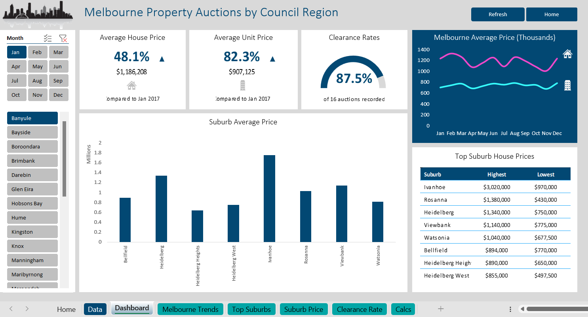

# Melbourne Property Auctions Analytics Dashboard (Excel)

## Overview
This project is an interactive Excel dashboard that analyzes Melbourne property auction data across months and council regions.

The dashboard provides a business intelligence-style interface that allows users to explore housing trends, average prices, and auction clearance rates through dynamic filters and visuals.

It demonstrates how Excel can function as a lightweight BI tool for reporting and decision-making.

---

## Key Insights Provided
- Average house price
- Average unit price
- Auction clearance rate
- Monthly price trends
- Suburb-level comparisons
- Top suburb price summaries

---

## Features
- KPI summary cards
- Line trend charts
- Bar charts
- Dynamic tables
- Month slicers
- Region filters
- Clean dashboard layout

---

## Skills Demonstrated
- Data cleaning and preparation
- PivotTables & PivotCharts
- Dashboard design
- KPI reporting
- Slicers & interactivity
- Visual storytelling with data
- Business intelligence principles

---

## Dashboard Preview

---

## Use Case
Useful for:
- Real estate analysis
- Market trend monitoring
- Investment research
- Regional comparisons

